# dftcluster2tensor

A Streamlit-based application to generate quantitatively accurate optical tensors from DFT-calculated NEXAFS spectra using hierarchical clustering and experimental refinement.

---

## 🚀 Overview

`dftcluster2tensor` is a visual analytics and refinement tool designed to:
- Parse **transition potential DFT** NEXAFS output files.
- Cluster transitions into spectral groups based on **overlap similarity**.
- Refine **oscillator strengths**, **transition energies**, and **TDM orientations** to experimental spectra.
- Output a **moiety-resolved optical tensor** validated across molecular orientations and packing structures.
- Visualize spectral features, molecular orbitals, and energy corrections interactively.

---

## 🧠 Key Features

- 📊 **Cluster-based dimensionality reduction** for transition analysis  
- ⚗️ **DFT-to-Experiment refinement pipeline** for spectral fitting  
- 📈 **Interactive plotting** of both total and atom-specific spectra  
- 🧬 **Moiety-level orbital traceability** for interpreting X-ray transitions  
- 🧪 **Polar angle (θ) analysis** to determine orientation-dependent absorbance  
- 💾 **XYZ and 3D visualization** of atomic coordinates and orbital distributions  
- 🔍 **Energy correction diagnostics** across TP, GND, and EXC calculations  

---

## ▶️ How to Run the Application

### 🧩 Prerequisites

Make sure you have the following installed:
- Python ≥ 3.9
- `streamlit`, `pandas`, `numpy`, `matplotlib`, `seaborn`, `scipy`, `plotly`, `py3Dmol`, `natsort`, `psutil`, `numba`, `stmol`

You can install dependencies using:

```bash
pip install -r requirements.txt
```

## 🧪 Running the App

From the root directory of the repo:

```bash
streamlit run stobe_loader.py
```

Make sure your output directory contains subfolders like GND/, TP/, and EXC/ with .out files from your DFT simulations.

## 📂 Project Structure

```text
📁 dftcluster2tensor/
 ├── stobe_loader.py            # Main Streamlit application
 ├── requirements.txt           # Required Python packages
 ├── sample_data/               # Example DFT output files (not included)
 └── README.md                  # You're here!
```

## 📖 Citation

If you use this tool in your research, please cite:

Victor Murcia, Obaid Alqahtani, Harlan Heilman, and Brian A. Collins.
Quantitative and bond-traceable resonant X-ray optical tensors of organic molecules.
arXiv:2509.01734 (2025). https://arxiv.org/abs/2509.01734

@misc{murcia2025quantitativebondtraceableresonantxray,
      title={Quantitative and bond-traceable resonant X-ray optical tensors of organic molecules}, 
      author={Victor Murcia and Obaid Alqahtani and Harlan Heilman and Brian A. Collins},
      year={2025},
      eprint={2509.01734},
      archivePrefix={arXiv},
      primaryClass={cond-mat.mtrl-sci},
      url={https://arxiv.org/abs/2509.01734}, 
}

## 📬 Contact

Feel free to reach out for questions, feedback, or collaboration!

Victor Murcia
📧 victor.murcia@wsu.edu

## App Screenshots

| 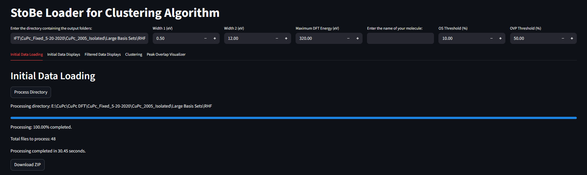  | 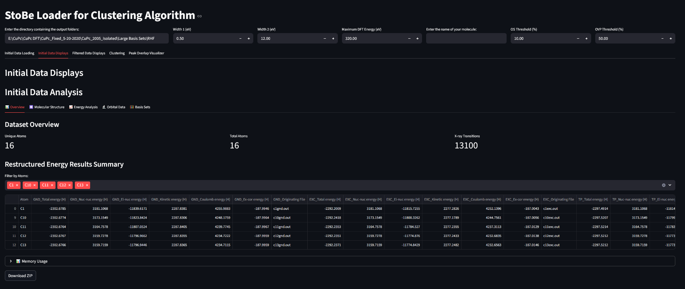  |
| --------------- | --------------- |
| 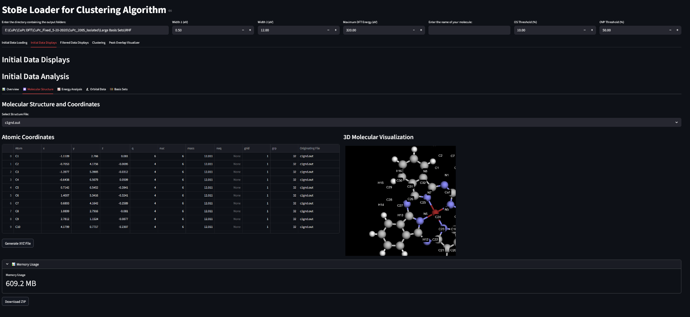  | 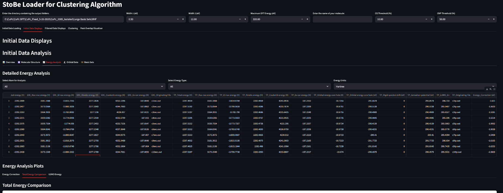  |
| 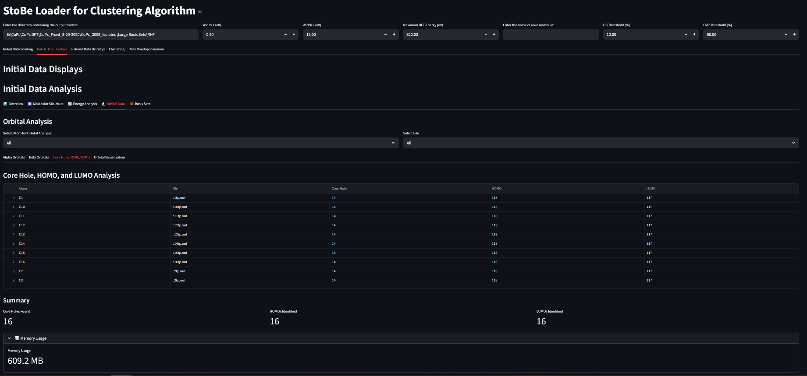  |   |
| 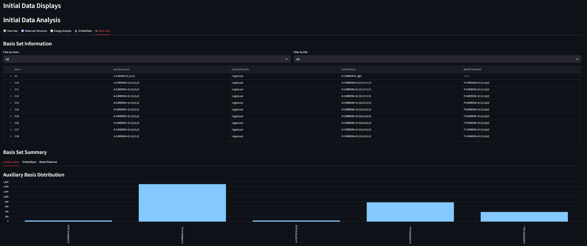  | 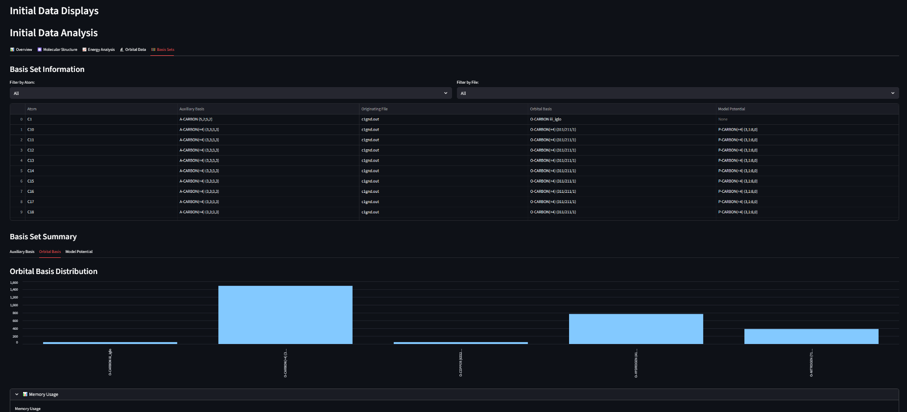  |
| 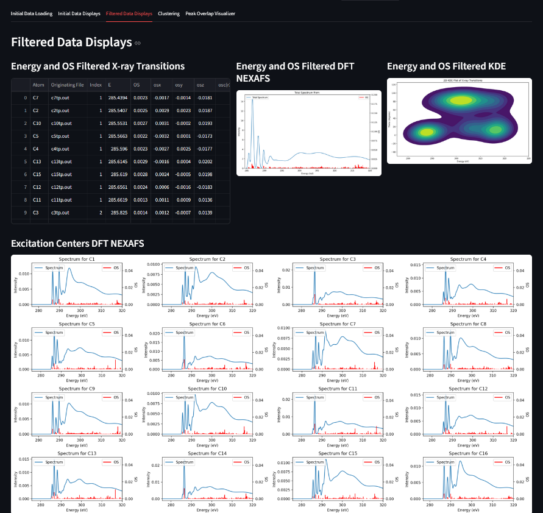  | 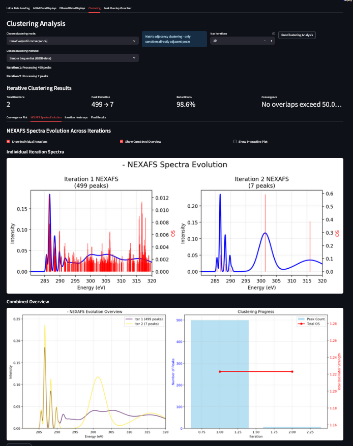 |
| 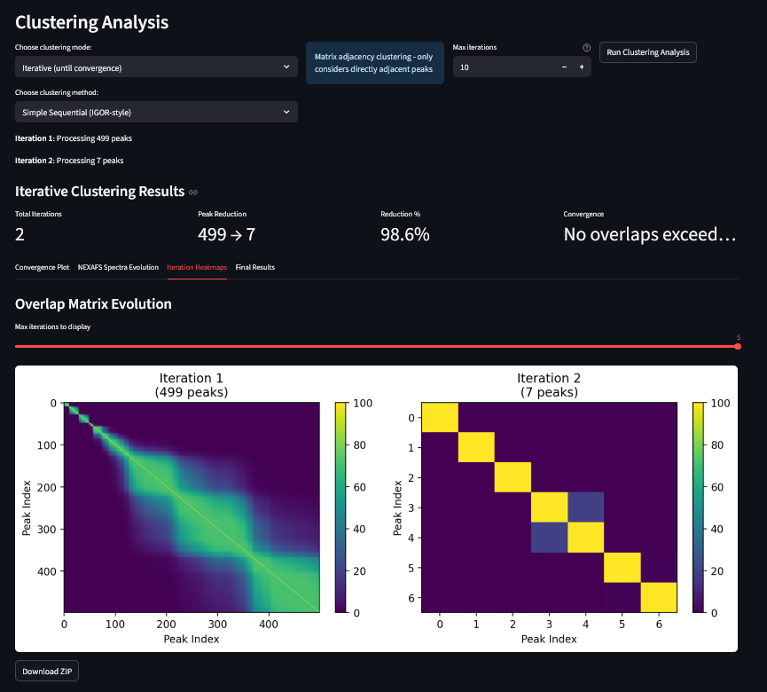 | 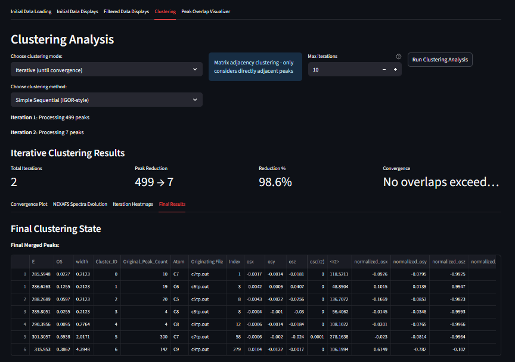 |
| 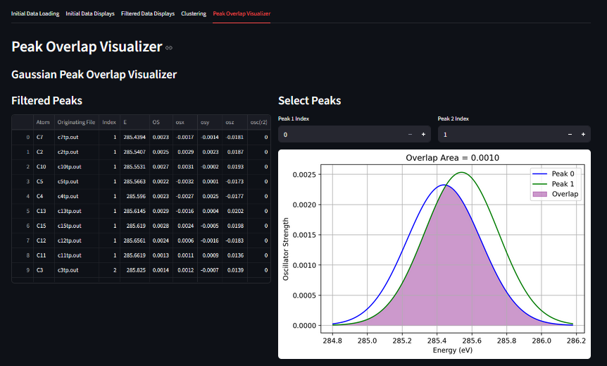 |                 |
